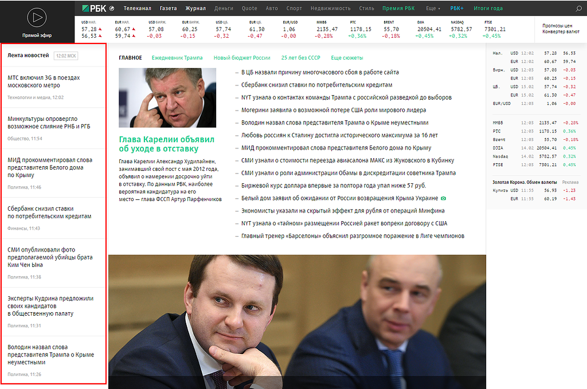

### Задача:
``Спарсить (программно) первые 15 новостей с rbk.ru (блок, откуда брать новости показан на скриншоте) и вставить в базу данных (составить структуру самому) или в файл. Вывести все новости, сократив текст до 200 символов в качестве описания, со ссылкой на полную новость с кнопкой подробнее. На полной новости выводить картинку если есть в новости.``



#### Команда для зауска парсенра находится по адресу:
`/app/Console/Commands/parser.php`

Для запуска запустить команду из корня проекта
```bash
 php artisan parse:rbk
```

#### Вывод новостей доступен по ссылке:
http://news.nn-rus.ru/